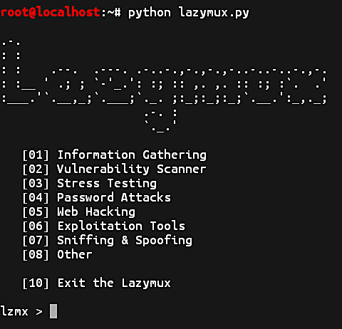

# Lazymux
Lazymux tools installer is very easy to use, only provided for lazy termux users.

## Screenshot


### Requirements
• Python 2.x

#### Installation and Using Lazymux
```
git clone https://github.com/Gameye98/Lazymux
```
```
cd Lazymux
```
```
python2 lazymux.py
```

## Contact Me
Line     : dtl.lily  
Telegram : @dtlily  
Facebook : cgi.izo  
Instagram: @dtlily  